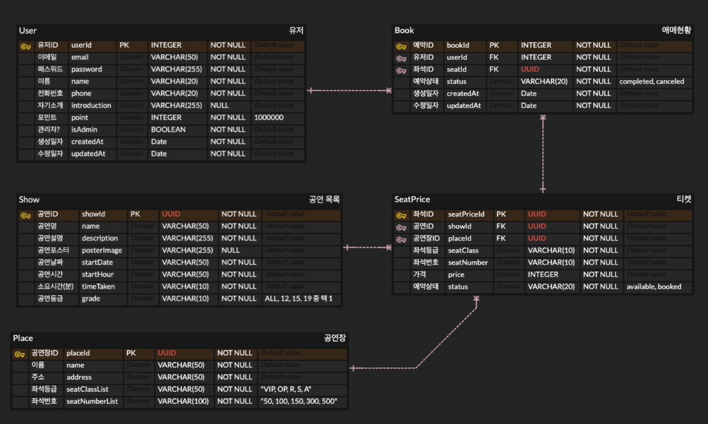

# 온라인 공연 예매 서비스 for TypeScript

## @types 설치를 통해 js 패키지와 TS의 sync 맞추기

우리가 일반적으로 사용하는 외부 javascript 패키지는 typescript 적용 시 그들 또한 타입 지정을 해줘야 한다. 그렇지 않을 경우 any타입을 지정해 버리거나, 엉뚱한 타입으로 자동 인식해 버리는 경우가 있다. 이 문제를 해결하기 위해서 각 패키지의 타입 정의가 이미 되어있는 "@types/패키지명" 파일을 dev 디펜던시에 설치해주면 해결된다.

```zsh
npm install typesync -g
```

typesync라는 라이브러리를 사용하면 기존에 설치된 패키지와 이름이 일치하는 @type 파일을 알아서 설치해주는 기능을 활용할 수 있다.

```zsh
# 자동으로 패키지의 @type(.d.ts) 파일 설치
npx typesync
```

하지만 패키지 설치 시 이름만 참조하고 버전은 참조하지 않는 것처럼 보였다. 이번 프로젝트는 `"multer-s3": "^2.10.0"`를 사용하지만 typesync를 실행하면 3.0.0 대 버전이 설치되었다. 이러한 경우는 수동으로 설치가 필요하다.

## PASSPORT를 활용한 로그인 인증 Flow

[passport로 로그인 인증 구현하기 참고](https://github.com/issuebombom/nodejs_study_alone/blob/main/express_auth_passport.md)

## ERD 아이디어



### 좌석 예약 FLOW

공연장(Place) 테이블과 공연(Show) 테이블을 생성하였고, 이 둘의 조합 +@로 판매될 좌석(티켓) 데이터를 생성하여 티켓(seatPrice) 테이블에 저장하는 방식을 취했다. 해당 티켓 테이블 목록에서 status가 avaliable한 경우 유저의 구매가 가능하도록 구현했으며, 구매 즉시 status는 'booked'가 된다.. 예약 쿼리는 예약데이터 생성, 포인트 차감, 티켓 상태 변경을 트랜잭션으로 일괄 처리하고, 선착순 예약제 이므로 해당 쿼리의 격리수준(ISOLATION LEVEL)을 READ COMMITTED로 설정하여 트랜잭션 점유 시 타 클라이언트의 수정이 불가하도록 한다.

### 구체적인 티켓 생성 방식

공연장 테이블에는 `보유 좌석의 등급`과 `각 등급별 좌석 수`를 csv 형태의 string으로 저장하도록 한다. 만약 A 공연장이 보유한 좌석 등급이 VIP, R, S, A라면 "VIP, R, S, A"와 같은 형태로 저장하도록 한다. 또한 각 등급별 좌석수를 "50, 100, 150, 300"으로 입력하도록 한다. 이렇게 되면 VIP 석은 총 50석이, R석은 100석이 존재함을 의미한다. (가령 VIP석이 50석이므로 VIP-1부터 VIP-50까지의 좌석번호가 주어진다고 가정했다.)

여기에 티켓(seatPrice) 테이블에 판매할 티켓(좌석)정보를 생성할 때는 추가적으로 등급별 price를 입력받는데 이 때 "110000, 90000, 70000, 50000"과 같은 형태로 받는다. 이렇게 되면 좌석 등급, 좌석 수, 등급별 가격을 각각 콤마(,)를 기준으로 split했을 때 length가 4인 배열이 생성되고, 각 배열에서 동일한 인덱스가 한 묶음이 된다.

먼저 VIP의 총 좌석 수가 50이면 이를 1 - 50 까지 생성되도록 반복문을 활용하여, VIP-1: 110000 ~ VIP-50: 110000의 정보가 생성되도록 한다. 이와 같은 방식으로 관리자가 사전에 티켓 데이터를 생성한다.

### 공연 테이블과 티켓 테이블 사이에 공연장 테이블을 끼워 둔 이유

최초 설계 시 투어 콘서트를 고려했다. 가령 아이유 투어 콘서트가 서울, 대구, 대전, 부산 등등에서 진행된다고 했을 때 해당 콘서트(공연)의 정보과 티켓 가격은 전국 동일할 것이다.(지역별 차등을 둬서 좋을 것은 없을 것이다. 만약 다르다해도 새로운 공연으로 생성하면 된다.) 그렇다면 콘서트에 대한 정보는 Show 테이블에서 하나만 존재하면 된다고 판단했다. 그리고 지역별 공연장에 대한 각각의 정보(좌석등급, 좌석수 정보 포함)를 Place 테이블에 저장한다면 투어 콘서트의 경우 하나의 공연에 여러 공연장을 1:1로 매칭해서 티켓을 간편하게 생성할 수 있게 된다고 생각했다.

만약 공연장(좌석정보) 테이블을 따로 두지 않는다면 매 공연 티켓 정보 생성 시 좌석 등급, 좌석 번호, 등급별 가격을 직접 찾아서 입력해야 할 것이다. 하지만 대체적으로 공연장 별 좌석 등급과 좌석 수는 고정되어 있기 때문에 공연장 테이블에서 각 공연장에 대한 정보를 따로 보관해 두는 것이 업무상 효율적일 것이다.

### 추가로 고려되어야 할 사항

위 로직에서는 등급이 곧 좌석번호가 된다는 것을 전제로 작성되었다. 하지만 실제 티켓팅을 보면 좌석 등급과 실 좌석 번호는 분리되어 있다. 가령 G-38 좌석이 VIP석일 수 있다. 이 부분이 고려되어 있지 않기 때문에 이 점을 보완하기 위해서는 추가적인 고민이 필요할 것 같다. 개인적으로 공연장의 총 좌석 수만큼 공연장 정보를 테이블에 생성하고 싶지는 않기 때문에 고민이 필요하다.

---

## CustomError 클래스를 활용한 메시지 생성

해당 프로젝트는 Routers, Controllers, Services 구조로 설계되었으며 Service 파일에서 데이터베이스 조회 결과에 따른 에러를 처리합니다.

Services에서 일괄적으로 상황에 따른 에러 처리를 하며 각 에러 상황에 따른 결과는 CustomError 클래스로 인스턴스를 생성하여 Controller에 넘겨줍니다.(throw)

```typescript
class CustomError extends Error {
  status: number;

  constructor(status: number, message: string) {
    super(message);
    this.name = this.constructor.name;
    this.status = status;
  }
}

export default CustomError;
```

위 클래스는 constructor를 통해 message와 status를 입력받아 message는 Error 클래스에 고스란히 전달되고, status는 신규 프로퍼티로 추가해 줍니다. name의 경우 contructor의 name 프로퍼티로 접근하면 클래스 이름 자체를 string 타입으로 가져올 수 있어 이를 그대로 this.name으로 지정합니다.

```typescript
// service.ts
isPermitted = async (userId: number, targetUserId: number) => {
  if (userId !== targetUserId) {
    throw new CustomError(403, '타 유저 프로필 접근 권한 없음');
  }
  return true;
};
```

검증이 필요한 상황에서 통과하지 못할 경우 service layer에서 CustomError 인스턴스를 생성하여 throw 합니다. 이는 Controller layer로 전달됩니다.

```typescript
findUser = async (req: Request, res: Response) => {
    const userId: string = req.params.userId; // 프론트에서 보낸 폼데이터를 받는다.

    try {
      // 요청을 보낸 유저
      const me = req.user as Client;

      // 조회 대상 프로필이 본인 프로필인지 검증
      const isApproval: boolean = await this.clientService.isPermitted(Number(userId), me.userId);
      /*
      유저 검색 로직...
      */
      }
    } catch (err) {
      if (err instanceof CustomError) {
        console.error(err.stack);
        return res.status(err.status).send({ message: `${err.message}` });
      }
    }
```

Service layer에서 isApproval() 함수가 throw한 CustomError 정보는 그대로 catch의 err 변수에 할당됩니다. 하지만 catch문의 err 변수는 기본적으로 unknown 타입으로 지정됩니다. 그렇기에 우리가 원하는 err 변수가 CustomError 타입일 경우 에러 메시지가 전달되도록 instanceof 기능을 적용했습니다.

터미널에서의 에러 결과는 아래와 같이 출력되며 프론트에서도 status code와 에러 메시지가 잘 전될되는 것을 확인했습니다.

```zsh
CustomError: 타 유저 프로필 접근 권한 없음
    at ClientService.isPermitted (/Users/leitmotiv/my-project/sparta_project/typescript_personal_project/dist/services/client.service.js:21:23)
    at ClientController.findUser (/Users/leitmotiv/my-project/sparta_project/typescript_personal_project/dist/controllers/client.controller.js:17:61)
    at Layer.handle [as handle_request] (/Users/leitmotiv/my-project/sparta_project/typescript_personal_project/node_modules/express/lib/router/layer.js:95:5)
    at next (/Users/leitmotiv/my-project/sparta_project/typescript_personal_project/node_modules/express/lib/router/route.js:144:13)
    at isLoggedIn (/Users/leitmotiv/my-project/sparta_project/typescript_personal_project/dist/middlewares/index.js:6:9)
    at Layer.handle [as handle_request] (/Users/leitmotiv/my-project/sparta_project/typescript_personal_project/node_modules/express/lib/router/layer.js:95:5)
    at next (/Users/leitmotiv/my-project/sparta_project/typescript_personal_project/node_modules/express/lib/router/route.js:144:13)
    at Route.dispatch (/Users/leitmotiv/my-project/sparta_project/typescript_personal_project/node_modules/express/lib/router/route.js:114:3)
    at Layer.handle [as handle_request] (/Users/leitmotiv/my-project/sparta_project/typescript_personal_project/node_modules/express/lib/router/layer.js:95:5)
    at /Users/leitmotiv/my-project/sparta_project/typescript_personal_project/node_modules/express/lib/router/index.js:284:15
```

## S3 Bucket을 이용한 공연 포스터 저장 Flow

```typescript
import multer from 'multer';
import multerS3 from 'multer-s3';
import AWS from 'aws-sdk';
import { v4 } from 'uuid';

const uuidv4 = v4;
const s3 = new AWS.S3({
  accessKeyId: process.env.S3_ACCESS_KEY,
  secretAccessKey: process.env.S3_SECRET_ACCESS_KEY,
  region: process.env.S3_BUCKET_REGION,
});

class UploadBucket {
  postImageDir: string;

  constructor() {
    // 포스트 사진 저장 경로
    this.postImageDir = 'images/show-posts';
  }

  // 버킷 업로드 틀
  upload = (saveDir: string) =>
    multer({
      storage: multerS3({
        s3: s3,
        bucket: process.env.S3_BUCKET_NAME as string,
        key: (req, file, callback) => {
          callback(null, `${saveDir}/${Date.now()}_${uuidv4()}`);
        },
        acl: 'public-read-write',
        contentType: multerS3.AUTO_CONTENT_TYPE, // 파일의 Content-Type 자동 설정
        metadata: (req, file, callback) => {
          callback(null, { fieldName: file.fieldname });
        },
      }),
    });

  // 공연 포스트 사진 버킷 업로드
  postImage = (targetFile: string) => this.upload(this.postImageDir).single(targetFile);
}

export default UploadBucket;
```

처음에는 이미지 저장 코드를 아래 코드와 같이 미들웨어로 적용하고자 `bucket.middleware.ts` 파일명으로 만들었습니다. multer와 multer-s3 모듈을 활용하면 위와 같이 AWS의 보안 자격 증명에서 생성한 엑세스 키와 버킷 이름을 설정하여 버킷에 바이너리 데이터를 저장할 수 있습니다.  
저장할 파일명은 현재 시각과 uuidv4를 이용해서 고유 랜덤값을 취하고 있습니다. 프론트에서 데이터를 전달할 때는 content-type을 `mulitpart/form-data`로 설정하지 않으면 백엔드에서 받아지지 않을 수도 있으니 반드시 content-type 설정이 필요하다.

```typescript
// router
import UploadBucket from '../middlewares/bucket.middleware';
upload = new UploadBucket();

router.post('/shows', isLoggedIn, upload.postImage('posterImg'), showController.postShow);
```

이와 같이 미들웨어를 추가하는 것 만으로도 편리하게 사용할 수 있으며 이후 Controller layer에서는 req.file.location 프로퍼티로 버킷에 저장된 파일의 링크주소를 확인할 수 있다.

하지만 대부분의 검증 과정이 컨트롤러에서 시작된다는 점을 고려했을 때 미들웨어로 multer를 적용하는 것은 다소 문제가 있다고 여겨졌다. 왜냐하면 Controller에서 검증 실패 에러가 처리되더라도 버킷에는 이미 데이터가 저장된 이후가 되기 때문이다. 이는 무분별한 파일 저장으로 이어질 수 있다.

이를 해결하기 위해서는 아래와 같이 컨트롤러 안에 버킷 저장 로직을 검증 과정 이후에 비치되도록 하였다.

```typescript
// show.controller.js
postShow = async (req: Request, res: Response, next: NextFunction) => {
  try {
    // let showInfo: Required<Show>;
    const { isAdmin } = req.user as User;
    this.showService.isPermitted(isAdmin);

    // s3 이미지 주소 추가
    // @type/multer에서 Express.Multer.File에 location: string 추가

    // 이미지 업로드
    const showInfo: Required<Show> = await new Promise((resolve) => {
      this.upload.postImage('posterImg')(req, res, (err) => {
        if (err instanceof MulterError) {
          console.error(err.stack);
          return res.send({ message: `${err.message}` });
        } else {
          // 공연 정보 받기
          let showInfo = req.body;
          // 이미지 주소 추가
          showInfo['posterImg'] = req.file?.location as string;
          resolve(showInfo);
        }
      });
    });
    await this.showService.createShow(showInfo);
    return res.send({ message: '공연 생성 완료' });
  } catch (err) {
    if (err instanceof CustomError) {
      console.error(err.stack);
      return res.status(err.status).send({ message: `${err.message}` });
    }
  }
};
```

postShow라는 함수 내부에서 비동기 처리 방식으로 순차 처리되도록 하기 위해 버킷 업로드 로직을 Promise객체로 감쌌다. 이렇게 해야 이전과 이후 과정이 req, res, next로 서로 연동되기 때문이다. await로 연결되지 않으면 req.file에 기록된 업로드 데이터의 메타데이터 정보를 가져올 수 없기 때문이기도 하다.  
특히 multer 모듈을 거치지 않으면 multipart/form-data를 가져오지 못하므로 req.body가 postImage함수의 콜백함수에서 작동되는 것을 확인할 수 있다.  
이제 isPermitted 함수를 통해 요청 유저가 관리자인지 먼저 검증한 이후 파일 업로드가 진행됨을 볼 수 있다. 그리고나서 이미지 링크를 확보하여 공연 테이블에 데이터를 추가하는 방식을 취하게 되었다.  
req.body.location에 대해서 첨언을 하자면 최초 @type/multer 파일에서 location 프로퍼티의 타입을 정의하고 있지 않았다. 이러한 경우 직접 .d.ts파일에 들어가 Express.Multer.File 타입 정의에 location: string 프로퍼티를 추가해주었다.


